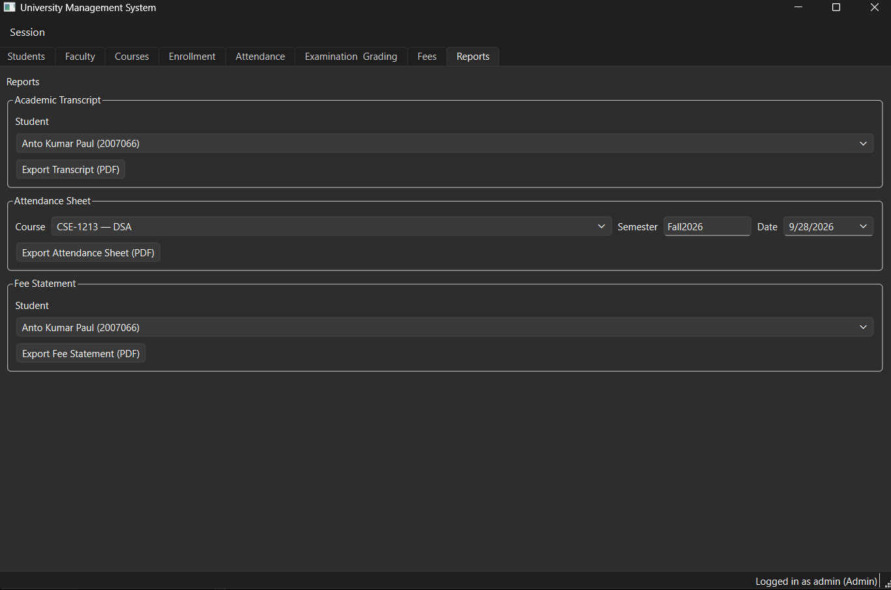
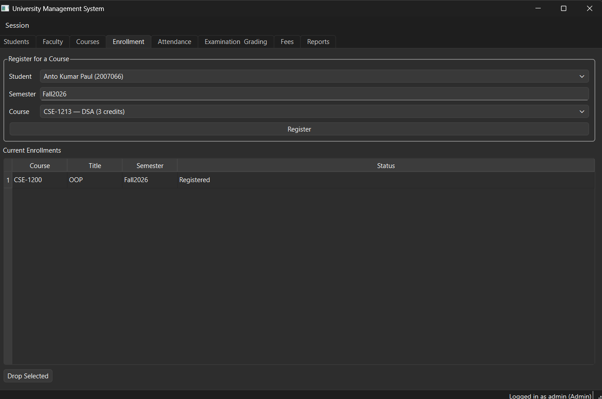
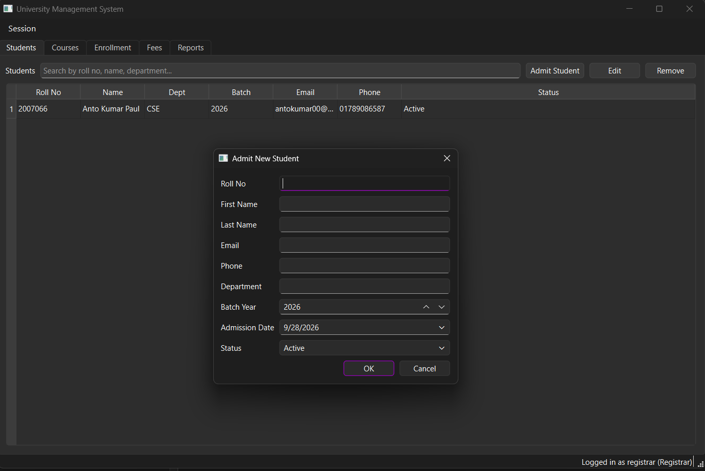
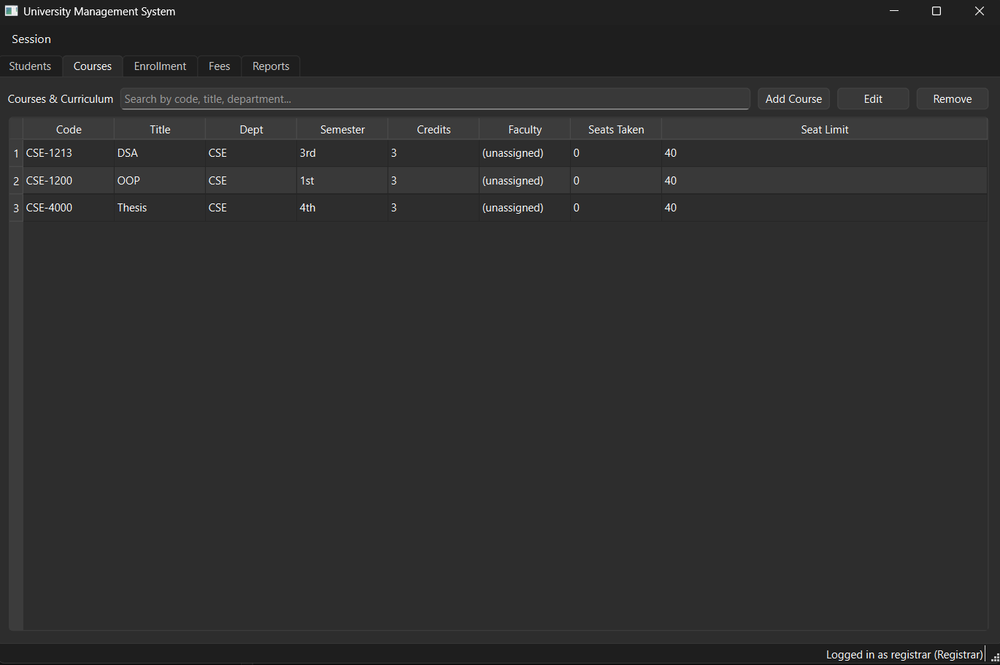
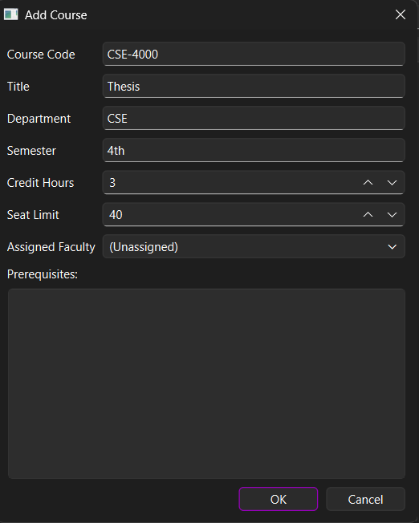

# University Management System

This is a desktop app I built to practice C++ and Qt by making something real instead of just doing small tutorial exercises. It's a **University Management System** — basically a tool an admin, registrar, or teacher could use to manage students, courses, enrollments, attendance, grades, fees, and reports, all from one app.

I'm still learning, so this project is a work in progress. Some parts (like Students and Courses) are fully working, and some parts (like Faculty) are only partly done. I'm sharing it anyway so people can see how it's built and follow along as I keep adding features.

## What this app does

The app is split into modules, shown as tabs across the top of the window:

- **Students** — add, search, edit, and remove students
- **Faculty** — manage faculty members (still being built)
- **Courses** — add courses, set credit hours, seat limits, prerequisites, and assign faculty
- **Enrollment** — register a student for a course and see their current enrollments
- **Attendance** — take and track attendance per course
- **Examination / Grading** — enter marks and calculate letter grades / GPA
- **Fees** — manage fee structures and payments
- **Reports** — export PDFs like academic transcripts, attendance sheets, and fee statements

There's also a login screen with **role-based access**, so an `admin`, a `registrar`, and other roles can see different things depending on their permissions.

## Screenshots

**Reports tab** — export a student's transcript, an attendance sheet, or a fee statement as a PDF:



**Enrollment tab** — register a student into a course and view their current enrollments:



**Students tab** — the "Admit New Student" form for adding a new student:



**Courses tab** — list of all courses with credits, faculty, and seat info:



**Add Course dialog** — creating a new course with prerequisites:



## How it's built

I'm using:

- **C++17**
- **Qt 6** — specifically the `Widgets`, `Sql`, and `PrintSupport` modules
- **CMake** as the build system
- **SQLite** as the database (no separate database server needed — it's just a local file)

### The general structure

I tried to keep the code organized into layers instead of putting everything in one file, which is something I'm still learning to do well:

- **Database layer** — a `DatabaseManager` singleton that opens the SQLite database and sets up the schema (tables for users/roles, students, faculty, courses, prerequisites, enrollments, attendance, grades, fee structures, and payments). On first run it auto-creates an admin login for you.
- **Models** — plain structs like `Student`, `Faculty`, `Course`, `Enrollment`, `GradeRecord`, `FeeStructure`, and `Payment` that represent the data.
- **DAO layer (Data Access Objects)** — one class per table (`StudentDao`, `FacultyDao`, `CourseDao`, `EnrollmentDao`, `AttendanceDao`, `GradeDao`, `FeeDao`, `UserDao`) that handles the actual SQL for creating, reading, updating, and deleting rows.
- **Service layer** — where the "business logic" lives:
  - `AuthService` — handles login and password hashing
  - `EnrollmentService` — checks seat limits, stops duplicate enrollments, and checks prerequisites before letting a student register
  - `GradingService` — turns raw marks into letter grades and calculates GPA/CGPA
  - `ReportService` — builds HTML and turns it into a PDF using `QPrinter`, for transcripts, attendance sheets, and fee statements
- **UI layer** — a `LoginWindow` for signing in, and a `MainWindow` that shows different tabs depending on your role. Each module (like Students) has its own widget and form dialog.

There's also a `Session` singleton that remembers who's logged in and what permissions they have, so the app can show or hide things based on role.

## Project status

Here's roughly what's done and what isn't, since I'm building this a bit at a time:

- [x] Database schema for all 8 modules, with an auto-created admin account
- [x] DAO layer for every module (real SQL, not fake/placeholder code)
- [x] Auth, Enrollment, Grading, and Report services
- [x] Login window and the main tabbed window
- [x] **Students module** — fully working (search, add, edit, delete)
- [ ] **Faculty module** — the "add/edit faculty" dialog is done, but the main faculty list widget isn't wired up yet
- [ ] Attendance, Examination/Grading, Fees UI screens (backend logic exists, UI still being connected)

## How to build and run it

You'll need:

- **Qt 6** installed (with Widgets, Sql, and PrintSupport modules — these come with the default Qt install)
- **CMake** (version 3.16 or newer)
- A C++ compiler (like MSVC on Windows, or GCC/Clang on Linux/Mac)

Steps:

1. **Clone the repository**
   ```bash
   git clone https://github.com/your-username/university-management-system.git
   cd university-management-system
   ```

2. **Create a build folder and run CMake**
   ```bash
   mkdir build
   cd build
   cmake ..
   ```

3. **Build the project**
   ```bash
   cmake --build .
   ```

4. **Run the app**
   The executable will be inside the `build` folder (the exact name/location can vary a bit depending on your OS and Qt setup).

On first launch, the app creates the SQLite database file automatically and seeds it with a default admin account, so there's no manual database setup needed.

## Logging in

Use the auto-created admin account to log in the first time:

- **Username:** `admin`
- **Password:** `admin123`

From there you can create courses, admit students, register enrollments, and so on. You can also log in as other roles (like `registrar`) if you create those accounts — the app changes which tabs are visible based on the role.

## Why I built this

I wanted a project that touches a lot of real-world concepts at once — a database, a GUI, multiple related tables, role-based permissions, and generating PDF reports — instead of a bunch of separate mini tutorials. It's not perfect and definitely not "production-ready," but every part of it (schema, DAOs, services, UI) is something I wrote and understand, and I'm actively adding to it.

If you're learning Qt/C++ too and want to poke around the code, feel free — and if you spot something I did in a weird or wrong way, I'd genuinely like to know, since that's the whole point of building this in public.

## License

Feel free to use this project for learning purposes.